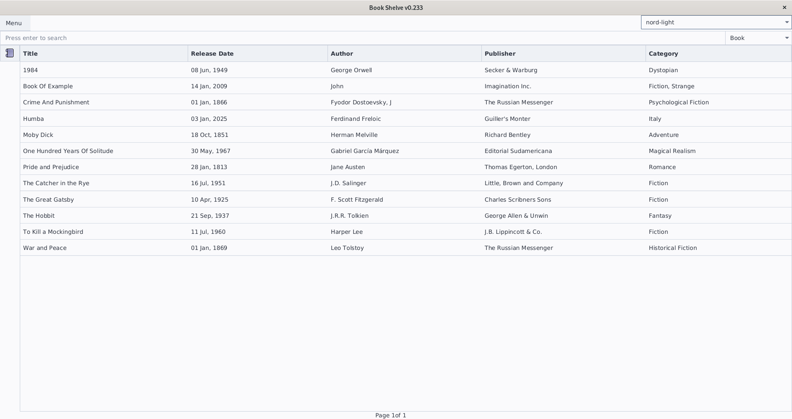

# Bookshelve Project

This is a Bookshelve application developed using Java 17 and JavaFX 17, with MariaDB for the database (via JDBC) and Hibernate for JPA.

## Features

- **CRUD Operations**: Manage books with functionalities to Create, Read, Update, and Delete.
- **Book Details**: Each book has a title, description, release date, categories, publishers, and authors.
- **User Authentication**: Secure authentication system to manage user access.

## Technologies

- **Java 17**: The programming language used for application development.
- **JavaFX 17**: The framework used for building the user interface.
- **MariaDB**: The relational database used for storing data.
- **JDBC**: Java Database Connectivity for connecting with MariaDB.
- **Hibernate (JPA)**: Java Persistence API used for mapping Java objects to database tables.

## Getting Started
### Requirements

- **Java 17**: Ensure Java 17 is installed. [Download Java 17](https://www.oracle.com/java/technologies/javase-jdk17-downloads.html)
- **MariaDB**: Install and configure MariaDB. [Download MariaDB](https://mariadb.org/download/)
- **JavaFX**: Download JavaFX SDK. [Download JavaFX](https://gluonhq.com/products/javafx/)
- **Maven/Gradle**: Use Maven or Gradle for dependency management.

### Installation

1. Clone the repository:
   ```sh
   git clone https://github.com/jota-br/bookshelf.git
   ```
2. Navigate to the project directory:
   ```sh
   cd bookshelf
   ```
3. Add the necessary dependencies to your `pom.xml` or `build.gradle` file for JavaFX, MariaDB, and Hibernate.

### Configuration

1. Configure your MariaDB database connection in the `application.properties` or `hibernate.cfg.xml` file.
   ```xml
   <!-- Example for hibernate.cfg.xml -->
   <property name="hibernate.connection.url">jdbc:mariadb://localhost:3306/bookshelve</property>
   <property name="hibernate.connection.username">dbUser</property>
   <property name="hibernate.connection.password">dbPassword</property>
   ```

## Functionalities

- Add, edit, delete, and view book details.
- Authenticate users to ensure secure access.

#### CSS Credits:
https://github.com/mkpaz/atlantafx <br/>
[nord-light.css](ostrovski.joao.ui/main/resources/ostrovski/joao/ui/css/nord-light.css) <br/>
<br/>
<br/>
